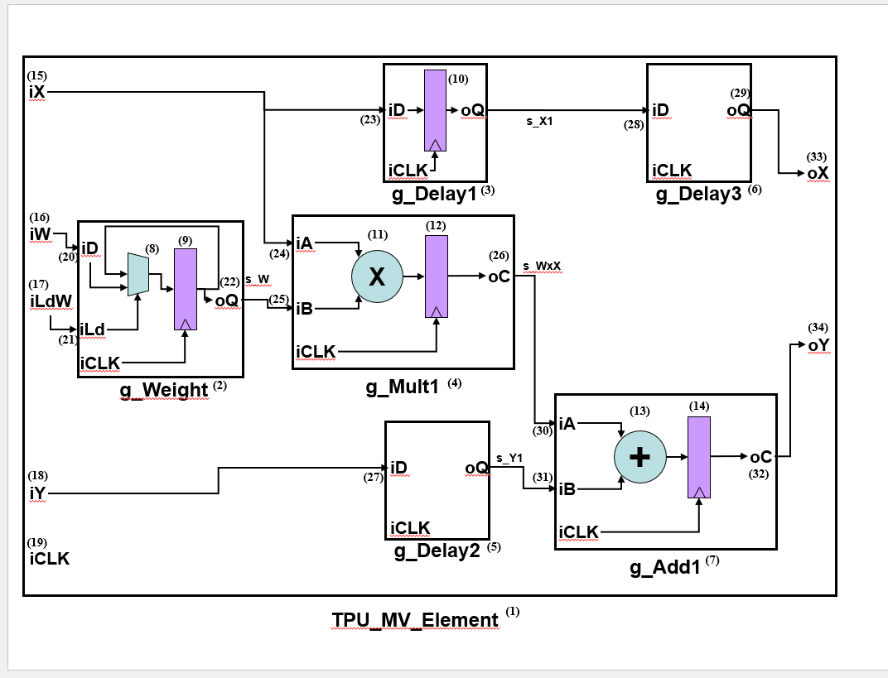

# 🧠 Combinational Logic Design and Verification

## 📌 Overview

This lab provided hands-on experience in designing and verifying fundamental combinational logic modules using **VHDL**. Emphasis was placed on correct implementation, **comprehensive testing**, debugging, and validation — all key skills for **product test engineering roles** in companies like **AMD**.

---

## ✅ Key Highlights Focused on Testing and Verification

### 🔍 Rigorous Verification with Exhaustive Testbenches

- Each module, including the **2:1 multiplexer**, **one’s complementor**, and **adder**, was tested with exhaustive or carefully selected input vectors to ensure correctness across all scenarios.
- Testbenches were crafted to simulate **all possible inputs** for small modules (e.g., 2:1 mux) and **representative edge cases** for larger N-bit modules (e.g., 32-bit adder).
- 📊 Waveform outputs from **QuestaSim** simulations were carefully examined and annotated to confirm behavior and correctness.

### 🐞 Debugging and Collaborative Problem Solving

- Encountered design bugs during simulation were **systematically documented** and discussed in our lab's shared Teams channel.
- Bug reports detailed the **symptoms**, **root cause hypotheses**, and final working solutions.
- Encouraged **peer support**, mirroring real-world engineering team dynamics in debugging and validation.

### 🏗️ Structural and Dataflow Modeling for Design Robustness

- Implemented each module in both **structural VHDL** (with gate primitives) and **dataflow VHDL** (using conditional signal assignments).
- This dual-method implementation helped **cross-verify functionality**, a standard practice in hardware validation for high-reliability products.

### 🧩 Modular, Reusable Design for Scalable Testing

- Used **generics and generate statements** to build scalable **N-bit modules** from 1-bit primitives.
- Testbenches were made **modular and parameterized**, allowing easy reuse and extension for other configurations — matching industry best practices.

### ➕➖ Adder-Subtractor Design with Integrated Control

- Designed a complex **adder-subtractor** module with a control bit (`nAdd_Sub`) to switch between addition and subtraction.
- Thoroughly tested with **diverse corner cases** to verify correctness and demonstrate robust control logic design.

---

## 📷 Simulation Snapshot

Below is a waveform output from QuestaSim verifying the correctness of a designed combinational module:

---

## 🔗 More Info

🗂️ Repo contains:  
- ✅ Structural and Dataflow VHDL files  
- ✅ Modular testbenches  
- ✅ Screenshots for waveform validation  
- ✅ Organized folders: `Mux/`, `OnesComp/`, `Adder/`, `AddSub/`  

> 🚀 Ideal for showcasing VHDL design, functional verification, and testing workflows — tailored for **product test engineering** roles.
